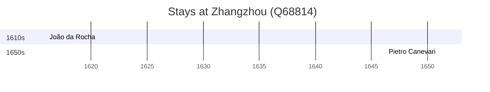

# Zhangzhou (Q68814)

*prefecture-level city in Fujian, China*

Wikidata: [Q68814](https://www.wikidata.org/wiki/Q68814)

2 occurrence(s) across 2 transcribed value(s), 2 person(s).

**Transcribed variants:**

- `Changchow` (1×, 1651–1651)
- `Changchow, Fukien` (1×, undated)

| Date | Variant | Person | Type | Entity id | Real entity |
|------|---------|--------|------|-----------|-------------|
| 1651 | Changchow | Pietro Canevari | estadia | [deh-pietro-canevari](deh-pietro-canevari) | — |
| >1616 | Changchow, Fukien | João da Rocha | estadia | [deh-joao-da-rocha](deh-joao-da-rocha) | — |

