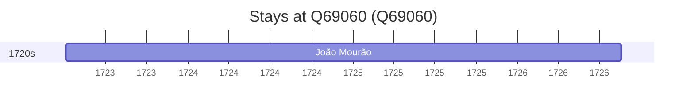

# Q69060

*(fetch error: HTTP Error 429: Too Many Requests)*

Wikidata: [Q69060](https://www.wikidata.org/wiki/Q69060)

3 occurrence(s) across 2 transcribed value(s), 2 person(s).

**Transcribed variants:**

- `Si-ning, Tartária` (2×, 1723–1726)
- `Sining` (1×, undated)

| Date | Variant | Person | Type | Entity id | Real entity |
|------|---------|--------|------|-----------|-------------|
| — | Sining | Johann Grueber | estadia | [deh-johann-grueber](deh-johann-grueber) | — |
| 1723-04-05 | Si-ning, Tartária | João Mourão | estadia | [deh-joao-mourao](deh-joao-mourao) | — |
| 1726-08-18 | Si-ning, Tartária | João Mourão | morte | [deh-joao-mourao](deh-joao-mourao) | — |

