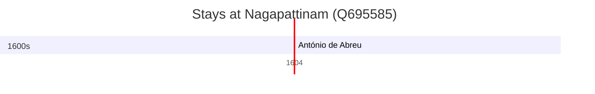

# Nagapattinam (Q695585)

*town in Tamil Nadu, India*

Wikidata: [Q695585](https://www.wikidata.org/wiki/Q695585)

2 occurrence(s) across 2 transcribed value(s), 2 person(s).

**Transcribed variants:**

- `Negapatam` (1×, 1583–1583)
- `Negapattinam, Índia` (1×, 1604–1604)

| Date | Variant | Person | Type | Entity id | Real entity |
|------|---------|--------|------|-----------|-------------|
| 1583-02-22 | Negapatam | Francisco Pérez | morte | [deh-francisco-perez](deh-francisco-perez) | [rp892854](rp892854) |
| 1604-01-06 | Negapattinam, Índia | António de Abreu | jesuita-votos-local | [deh-antonio-de-abreu](deh-antonio-de-abreu) | [rp796356](rp796356) |

