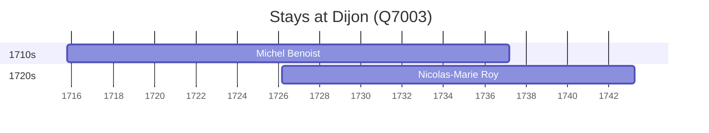

# Dijon (Q7003)

*commune in Côte-d'Or, France*

Wikidata: [Q7003](https://www.wikidata.org/wiki/Q7003)

2 occurrence(s) across 2 transcribed value(s), 2 person(s).

**Transcribed variants:**

- `Dijon (paróquia de St Jean)` (1×, 1715–1715)
- `Dijon` (1×, 1726–1726)

| Date | Variant | Person | Type | Entity id | Real entity |
|------|---------|--------|------|-----------|-------------|
| 1715-10-08 | Dijon (paróquia de St Jean) | Michel Benoist | nascimento | [deh-michel-benoist](deh-michel-benoist) | — |
| 1726-03-12 | Dijon | Nicolas-Marie Roy | nascimento | [deh-nicolas-marie-roy](deh-nicolas-marie-roy) | — |

### Co-presence

These persons were plausibly at this place during overlapping periods (interval estimation from stay dates; rough — see method note below).

| Period | Persons |
|--------|---------|
| 1720s | [Michel Benoist](deh-michel-benoist), [Nicolas-Marie Roy](deh-nicolas-marie-roy) |

*1 overlapping pair(s) involving 2 person(s). Method: interval start = stay event date; end = next embarque/partida/different-place event, or death, or +15yr cap.*

