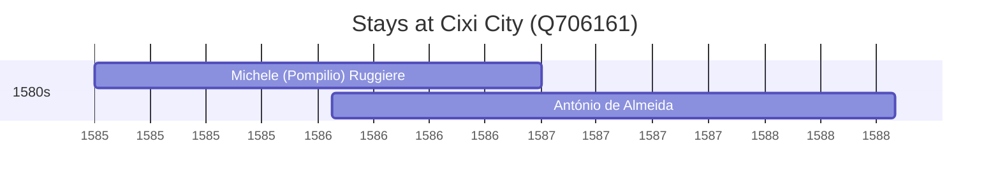

# Cixi City (Q706161)

*county-level city in Ningbo, Zhejiang Province, China*

Wikidata: [Q706161](https://www.wikidata.org/wiki/Q706161)

2 occurrence(s) across 2 transcribed value(s), 2 person(s).

**Transcribed variants:**

- `Chao-hing` (1×, 1585–1585)
- `«Ciquione» (Shaoshing, Chao-hing), Tchö-kiang` (1×, 1586–1586)

| Date | Variant | Person | Type | Entity id | Real entity |
|------|---------|--------|------|-----------|-------------|
| 1585 | Chao-hing | Michele (Pompilio) Ruggiere | estadia | [deh-michele-ruggiere](deh-michele-ruggiere) | — |
| 1586-01-23 | «Ciquione» (Shaoshing, Chao-hing), Tchö-kiang | António de Almeida | estadia | [deh-antonio-de-almeida](deh-antonio-de-almeida) | — |

### Co-presence

These persons were plausibly at this place during overlapping periods (interval estimation from stay dates; rough — see method note below).

| Period | Persons |
|--------|---------|
| 1580s | [António de Almeida](deh-antonio-de-almeida), [Michele (Pompilio) Ruggiere](deh-michele-ruggiere) |

*1 overlapping pair(s) involving 2 person(s). Method: interval start = stay event date; end = next embarque/partida/different-place event, or death, or +15yr cap.*

