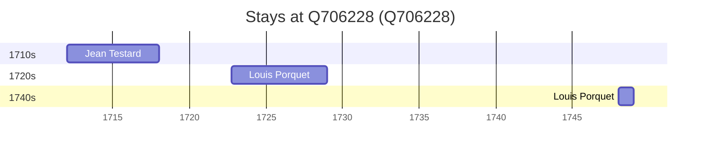

# Q706228

*(fetch error: HTTP Error 429: Too Many Requests)*

Wikidata: [Q706228](https://www.wikidata.org/wiki/Q706228)

5 occurrence(s) across 2 transcribed value(s), 2 person(s).

**Transcribed variants:**

- `P'ing-hou (Tchö-kiang)` (1×, 1712–1712)
- `Pinghu (P'ing-hou, Tchö-kiang)` (4×, 1722–1748)

| Date | Variant | Person | Type | Entity id | Real entity |
|------|---------|--------|------|-----------|-------------|
| 1712 | P'ing-hou (Tchö-kiang) | Jean Testard | estadia | [deh-jean-testard](deh-jean-testard) | — |
| 1722-10 | Pinghu (P'ing-hou, Tchö-kiang) | Louis Porquet | estadia | [deh-louis-porquet](deh-louis-porquet) | [rp585015](rp585015) |
| 1723-09 | Pinghu (P'ing-hou, Tchö-kiang) | Louis Porquet | estadia | [deh-louis-porquet](deh-louis-porquet) | [rp585015](rp585015) |
| 1729 | Pinghu (P'ing-hou, Tchö-kiang) | Louis Porquet | estadia | [deh-louis-porquet](deh-louis-porquet) | [rp585015](rp585015) |
| 1748 | Pinghu (P'ing-hou, Tchö-kiang) | Louis Porquet | estadia | [deh-louis-porquet](deh-louis-porquet) | [rp585015](rp585015) |

