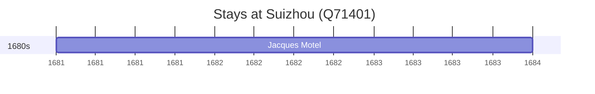

# Suizhou (Q71401)

*prefecture-level city in Hubei, China*

Wikidata: [Q71401](https://www.wikidata.org/wiki/Q71401)

1 occurrence(s) across 1 transcribed value(s), 1 person(s).

**Transcribed variants:**

- `Suichow, Hou-pei (montanhas)` (1×, 1681–1681)

| Date | Variant | Person | Type | Entity id | Real entity |
|------|---------|--------|------|-----------|-------------|
| 1681 | Suichow, Hou-pei (montanhas) | Jacques Motel | estadia | [deh-jacques-motel](deh-jacques-motel) | — |

