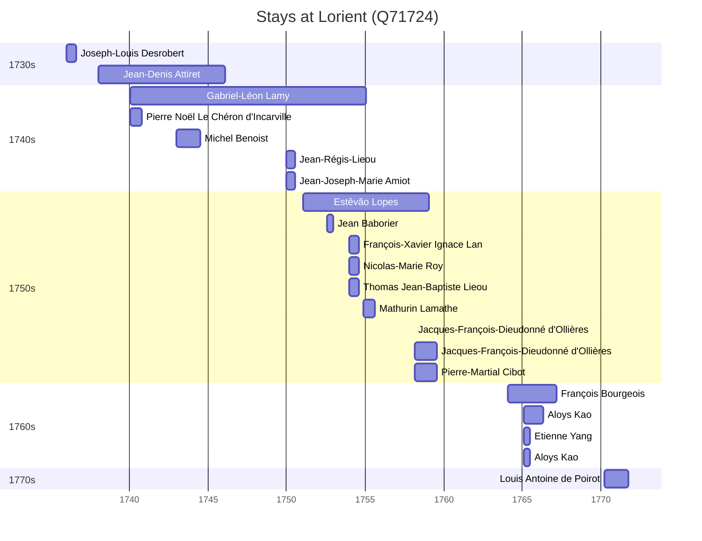

# Lorient (Q71724)

*commune in Morbihan, France*

Wikidata: [Q71724](https://www.wikidata.org/wiki/Q71724)

22 occurrence(s) across 2 transcribed value(s), 21 person(s).

**Transcribed variants:**

- `Lorient` (21×, 1736–1770)
- `Lorient (Igreja da paróquia de Saint Louis)` (1×, 1758–1758)

| Date | Variant | Person | Type | Entity id | Real entity |
|------|---------|--------|------|-----------|-------------|
| 1736 | Lorient | Joseph-Louis Desrobert | estadia | [deh-joseph-louis-desrobert](deh-joseph-louis-desrobert) | — |
| 1738-01-08 | Lorient | Jean-Denis Attiret | estadia | [deh-jean-denis-attiret](deh-jean-denis-attiret) | — |
| 1740-01-19 | Lorient | Gabriel-Léon Lamy | estadia | [deh-gabriel-leon-lamy](deh-gabriel-leon-lamy) | — |
| 1740-01-19 | Lorient | Pierre Noël Le Chéron d'Incarville | estadia | [deh-pierre-noel-le-cheron-dincarville](deh-pierre-noel-le-cheron-dincarville) | — |
| 1743 | Lorient | Michel Benoist | estadia | [deh-michel-benoist](deh-michel-benoist) | — |
| 1749-12-19 | Lorient | Jean-Régis-Lieou | estadia | [deh-jean-regis-lieou](deh-jean-regis-lieou) | [rp660632](rp660632) |
| 1749-12-29 | Lorient | Jean-Joseph-Marie Amiot | estadia | [deh-jean-joseph-marie-amiot](deh-jean-joseph-marie-amiot) | — |
| 1749-12-29 | Lorient | Jean-Régis-Lieou | estadia | [deh-jean-joseph-marie-amiot-ref1](deh-jean-joseph-marie-amiot-ref1) | [rp660632](rp660632) |
| 1751-01-14 | Lorient | Estêvão Lopes | chegada | [deh-estevao-lopes](deh-estevao-lopes) | — |
| 1752-07-28 | Lorient | Jean Baborier | estadia | [deh-jean-baborier](deh-jean-baborier) | — |
| 1753-12-29 | Lorient | François-Xavier Ignace Lan | estadia | [deh-francois-xavier-ignace-lan](deh-francois-xavier-ignace-lan) | — |
| 1753-12-29 | Lorient | Nicolas-Marie Roy | estadia | [deh-nicolas-marie-roy](deh-nicolas-marie-roy) | — |
| 1753-12-29 | Lorient | Thomas Jean-Baptiste Lieou | estadia | [deh-thomas-jean-baptiste-lieou](deh-thomas-jean-baptiste-lieou) | — |
| 1754-11-22 | Lorient | Mathurin Lamathe | estadia | [deh-mathurin-lamathe](deh-mathurin-lamathe) | — |
| 1758-02-02 | Lorient (Igreja da paróquia de Saint Louis) | Jacques-François-Dieudonné d'Ollières | jesuita-votos-local | [deh-jacques-francois-dieudonne-dollieres](deh-jacques-francois-dieudonne-dollieres) | — |
| 1758-03-07 | Lorient | Jacques-François-Dieudonné d'Ollières | estadia | [deh-jacques-francois-dieudonne-dollieres](deh-jacques-francois-dieudonne-dollieres) | — |
| 1758-03-07 | Lorient | Pierre-Martial Cibot | estadia | [deh-pierre-martial-cibot](deh-pierre-martial-cibot) | [rp459497](rp459497) |
| 1764-01-19 | Lorient | François Bourgeois | estadia | [deh-francois-bourgeois](deh-francois-bourgeois) | — |
| 1765-02-01 | Lorient | Aloys Kao | estadia | [deh-aloys-kao](deh-aloys-kao) | — |
| 1765-02-01 | Lorient | Etienne Yang | estadia | [deh-etienne-yang](deh-etienne-yang) | — |
| 1765-02-01 | Lorient | Aloys Kao | estadia | [deh-etienne-yang-ref1](deh-etienne-yang-ref1) | — |
| 1770-03-20 | Lorient | Louis Antoine de Poirot | estadia | [deh-louis-antoine-de-poirot](deh-louis-antoine-de-poirot) | — |

### Co-presence

These persons were plausibly at this place during overlapping periods (interval estimation from stay dates; rough — see method note below).

| Period | Persons |
|--------|---------|
| 1740s | [Jean-Denis Attiret](deh-jean-denis-attiret), [Jean-Joseph-Marie Amiot](deh-jean-joseph-marie-amiot), [Jean-Régis-Lieou](rp660632), [Michel Benoist](deh-michel-benoist), [Pierre Noël Le Chéron d'Incarville](deh-pierre-noel-le-cheron-dincarville) |
| 1750s | [Estêvão Lopes](deh-estevao-lopes), [François-Xavier Ignace Lan](deh-francois-xavier-ignace-lan), [Jacques-François-Dieudonné d'Ollières](deh-jacques-francois-dieudonne-dollieres), [Jean Baborier](deh-jean-baborier), [Mathurin Lamathe](deh-mathurin-lamathe), [Nicolas-Marie Roy](deh-nicolas-marie-roy), [Pierre-Martial Cibot](rp459497), [Thomas Jean-Baptiste Lieou](deh-thomas-jean-baptiste-lieou) |
| 1760s | [Aloys Kao](deh-aloys-kao), [Aloys Kao](deh-etienne-yang-ref1), [Etienne Yang](deh-etienne-yang), [François Bourgeois](deh-francois-bourgeois) |

*21 overlapping pair(s) involving 17 person(s). Method: interval start = stay event date; end = next embarque/partida/different-place event, or death, or +15yr cap.*

