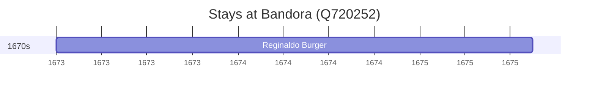

# Bandora (Q720252)

*human settlement*

Wikidata: [Q720252](https://www.wikidata.org/wiki/Q720252)

1 occurrence(s) across 1 transcribed value(s), 1 person(s).

**Transcribed variants:**

- `Bandora, Índia` (1×, 1673–1673)

| Date | Variant | Person | Type | Entity id | Real entity |
|------|---------|--------|------|-----------|-------------|
| 1673 | Bandora, Índia | Reginaldo Burger | estadia | [deh-reginaldo-burger](deh-reginaldo-burger) | — |

