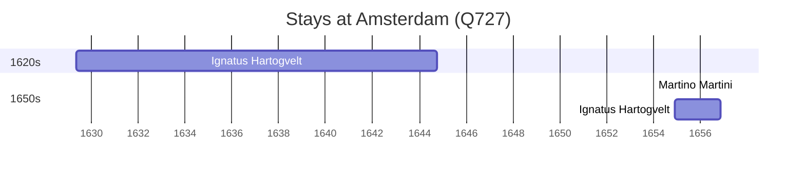

# Amsterdam (Q727)

*capital and most populous city of the Netherlands*

Wikidata: [Q727](https://www.wikidata.org/wiki/Q727)

4 occurrence(s) across 1 transcribed value(s), 3 person(s).

**Transcribed variants:**

- `Amesterdão` (4×, 1629–1654)

| Date | Variant | Person | Type | Entity id | Real entity |
|------|---------|--------|------|-----------|-------------|
| — | Amesterdão | Bernard Rodes | estadia | [deh-bernard-rodes](deh-bernard-rodes) | — |
| 1629-05-16 | Amesterdão | Ignatus Hartogvelt | nascimento | [deh-ignatus-hartogvelt](deh-ignatus-hartogvelt) | — |
| 1654 | Amesterdão | Martino Martini | estadia | [deh-martino-martini](deh-martino-martini) | — |
| 1654-11-27 | Amesterdão | Ignatus Hartogvelt | estadia | [deh-ignatus-hartogvelt](deh-ignatus-hartogvelt) | — |

