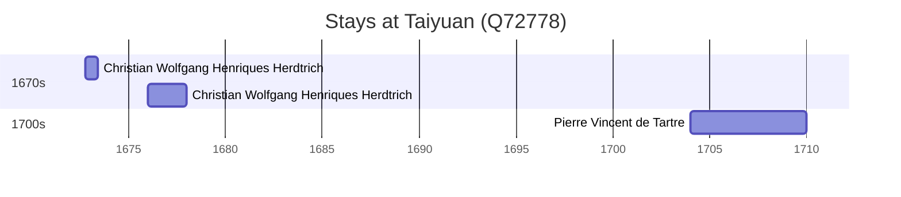

# Taiyuan (Q72778)

*capital city of Shanxi province, China*

Wikidata: [Q72778](https://www.wikidata.org/wiki/Q72778)

4 occurrence(s) across 3 transcribed value(s), 3 person(s).

**Transcribed variants:**

- `Taiyüan, Shansi` (2×, 1672–1704)
- `Taiyüan` (1×, 1676–1676)
- `T'ai-yuan fou` (1×, undated)

| Date | Variant | Person | Type | Entity id | Real entity |
|------|---------|--------|------|-----------|-------------|
| — | T'ai-yuan fou | Michel Trigault | estadia | [deh-michel-trigault](deh-michel-trigault) | — |
| 1672-10-05 | Taiyüan, Shansi | Christian Wolfgang Henriques Herdtrich | estadia | [deh-christian-wolfgang-henriques-herdtrich](deh-christian-wolfgang-henriques-herdtrich) | [rp669413](rp669413) |
| 1676 | Taiyüan | Christian Wolfgang Henriques Herdtrich | estadia | [deh-christian-wolfgang-henriques-herdtrich](deh-christian-wolfgang-henriques-herdtrich) | [rp669413](rp669413) |
| 1704 | Taiyüan, Shansi | Pierre Vincent de Tartre | estadia | [deh-pierre-vincent-de-tartre](deh-pierre-vincent-de-tartre) | — |

