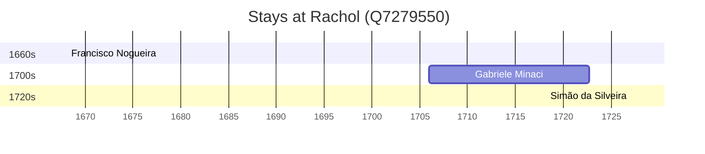

# Rachol (Q7279550)

*village in Goa, India*

Wikidata: [Q7279550](https://www.wikidata.org/wiki/Q7279550)

4 occurrence(s) across 2 transcribed value(s), 3 person(s).

**Transcribed variants:**

- `Rachol` (3×, 1668–1727)
- `Rachol (colégio)` (1×, 1706–1706)

| Date | Variant | Person | Type | Entity id | Real entity |
|------|---------|--------|------|-----------|-------------|
| 1668-02-02 | Rachol | Francisco Nogueira | jesuita-votos-local | [deh-francisco-nogueira](deh-francisco-nogueira) | — |
| 1706 | Rachol (colégio) | Gabriele Minaci | estadia | [deh-gabriele-minaci](deh-gabriele-minaci) | — |
| 1722-09-14 | Rachol | Gabriele Minaci | morte | [deh-gabriele-minaci](deh-gabriele-minaci) | — |
| 1727-02-02 | Rachol | Simão da Silveira | jesuita-votos-local | [deh-simao-da-silveira](deh-simao-da-silveira) | — |

