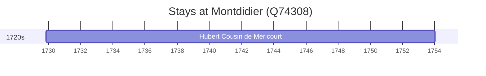

# Montdidier (Q74308)

*commune in Somme, France*

Wikidata: [Q74308](https://www.wikidata.org/wiki/Q74308)

2 occurrence(s) across 2 transcribed value(s), 1 person(s).

**Transcribed variants:**

- `Montdidier` (1×, 1729–1729)
- `Montdidier (paróquia de St. Pierre)` (1×, 1729–1729)

| Date | Variant | Person | Type | Entity id | Real entity |
|------|---------|--------|------|-----------|-------------|
| 1729-11-07 | Montdidier | Hubert Cousin de Méricourt | nascimento | [deh-hubert-cousin-de-mericourt](deh-hubert-cousin-de-mericourt) | — |
| 1729-11-08 | Montdidier (paróquia de St. Pierre) | Hubert Cousin de Méricourt | baptizado | [deh-hubert-cousin-de-mericourt](deh-hubert-cousin-de-mericourt) | — |

