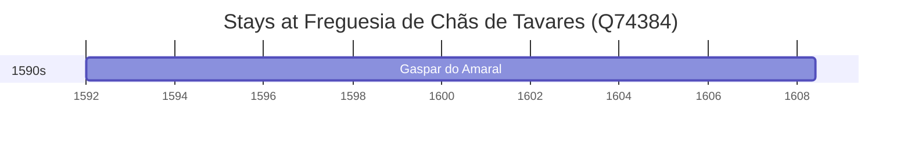

# Freguesia de Chãs de Tavares (Q74384)

*former civil parish in Portugal*

Wikidata: [Q74384](https://www.wikidata.org/wiki/Q74384)

1 occurrence(s) across 1 transcribed value(s), 1 person(s).

**Transcribed variants:**

- `Corvaceira, diocese de Viseu` (1×, 1592–1592)

| Date | Variant | Person | Type | Entity id | Real entity |
|------|---------|--------|------|-----------|-------------|
| 1592 | Corvaceira, diocese de Viseu | Gaspar do Amaral | nascimento | [deh-gaspar-do-amaral](deh-gaspar-do-amaral) | — |

