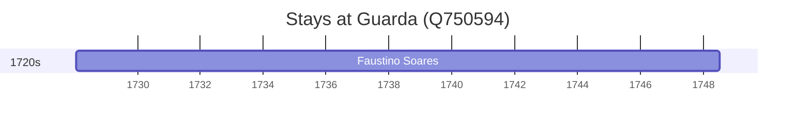

# Guarda (Q750594)

*municipality in Portugal*

Wikidata: [Q750594](https://www.wikidata.org/wiki/Q750594)

1 occurrence(s) across 1 transcribed value(s), 1 person(s).

**Transcribed variants:**

- `Guarda` (1×, 1728–1728)

| Date | Variant | Person | Type | Entity id | Real entity |
|------|---------|--------|------|-----------|-------------|
| 1728-01-18 | Guarda | Faustino Soares | nascimento | [deh-faustino-soares](deh-faustino-soares) | — |

