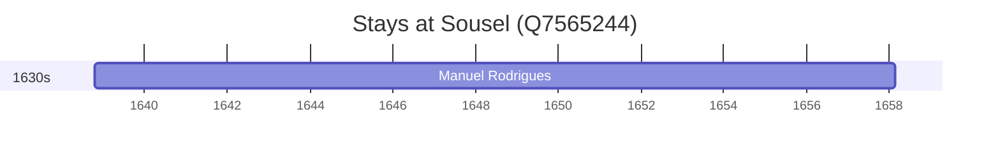

# Sousel (Q7565244)

*municipality of Portugal*

Wikidata: [Q7565244](https://www.wikidata.org/wiki/Q7565244)

1 occurrence(s) across 1 transcribed value(s), 1 person(s).

**Transcribed variants:**

- `Sousel, diocese de Évora` (1×, 1638–1638)

| Date | Variant | Person | Type | Entity id | Real entity |
|------|---------|--------|------|-----------|-------------|
| 1638-10-18 | Sousel, diocese de Évora | Manuel Rodrigues | nascimento | [deh-manuel-rodrigues-ii](deh-manuel-rodrigues-ii) | — |

