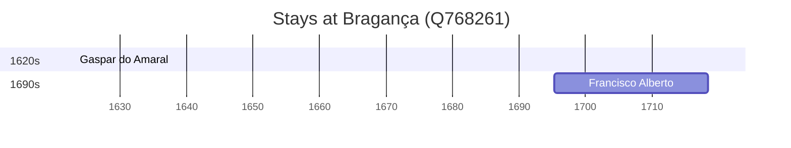

# Bragança (Q768261)

*municipality in Portugal*

Wikidata: [Q768261](https://www.wikidata.org/wiki/Q768261)

2 occurrence(s) across 1 transcribed value(s), 2 person(s).

**Transcribed variants:**

- `Bragança` (2×, 1695–1695)

| Date | Variant | Person | Type | Entity id | Real entity |
|------|---------|--------|------|-----------|-------------|
| 1695-04-24 | Bragança | Francisco Alberto | nascimento | [deh-francisco-alberto](deh-francisco-alberto) | — |
| <1623-03-24 | Bragança | Gaspar do Amaral | estadia-x | [deh-gaspar-do-amaral](deh-gaspar-do-amaral) | — |

