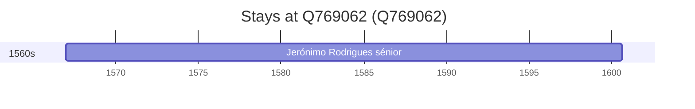

# Q769062

*(fetch error: HTTP Error 429: Too Many Requests)*

Wikidata: [Q769062](https://www.wikidata.org/wiki/Q769062)

1 occurrence(s) across 1 transcribed value(s), 1 person(s).

**Transcribed variants:**

- `Monforte, diocese de Elvas` (1×, 1567–1567)

| Date | Variant | Person | Type | Entity id | Real entity |
|------|---------|--------|------|-----------|-------------|
| 1567 | Monforte, diocese de Elvas | Jerónimo Rodrigues, sénior | nascimento | [deh-jeronimo-rodrigues-senior](deh-jeronimo-rodrigues-senior) | — |

