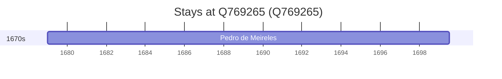

# Q769265

*(fetch error: HTTP Error 429: Too Many Requests)*

Wikidata: [Q769265](https://www.wikidata.org/wiki/Q769265)

1 occurrence(s) across 1 transcribed value(s), 1 person(s).

**Transcribed variants:**

- `Santo André` (1×, 1679–1679)

| Date | Variant | Person | Type | Entity id | Real entity |
|------|---------|--------|------|-----------|-------------|
| 1679 | Santo André | Pedro de Meireles | nascimento | [deh-pedro-de-meireles](deh-pedro-de-meireles) | — |

