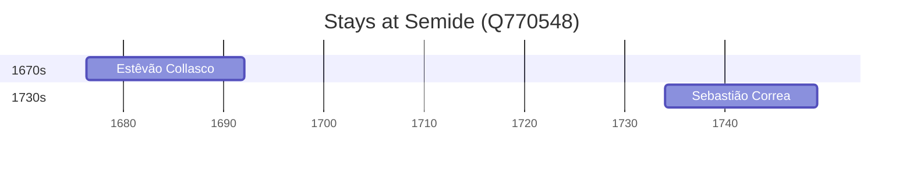

# Semide (Q770548)

*former civil parish in Portugal*

Wikidata: [Q770548](https://www.wikidata.org/wiki/Q770548)

2 occurrence(s) across 1 transcribed value(s), 2 person(s).

**Transcribed variants:**

- `Semide, diocese de Coimbra` (2×, 1676–1734)

| Date | Variant | Person | Type | Entity id | Real entity |
|------|---------|--------|------|-----------|-------------|
| 1676-04-21 | Semide, diocese de Coimbra | Estêvão Collasco | nascimento | [deh-estevao-collasco](deh-estevao-collasco) | — |
| 1734-01-20 | Semide, diocese de Coimbra | Sebastião Correa | nascimento | [deh-sebastiao-correa](deh-sebastiao-correa) | — |

