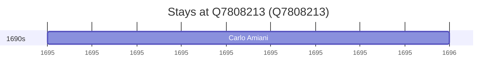

# Q7808213

*(fetch error: HTTP Error 429: Too Many Requests)*

Wikidata: [Q7808213](https://www.wikidata.org/wiki/Q7808213)

1 occurrence(s) across 1 transcribed value(s), 1 person(s).

**Transcribed variants:**

- `Tingchow, Fukien` (1×, 1695–1695)

| Date | Variant | Person | Type | Entity id | Real entity |
|------|---------|--------|------|-----------|-------------|
| 1695-10-30 | Tingchow, Fukien | Carlo Amiani | estadia | [deh-carlo-amiani](deh-carlo-amiani) | — |

