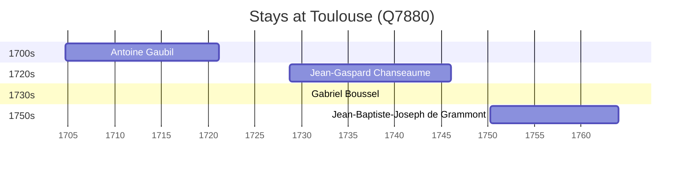

# Toulouse (Q7880)

*French commune and city in Haute-Garonne, Occitania*

Wikidata: [Q7880](https://www.wikidata.org/wiki/Q7880)

4 occurrence(s) across 3 transcribed value(s), 4 person(s).

**Transcribed variants:**

- `Toulouse` (2×, 1704–1728)
- `Toulouse (capela da casa professa)` (1×, 1730–1730)
- `Toulouse (província)` (1×, 1750–1750)

| Date | Variant | Person | Type | Entity id | Real entity |
|------|---------|--------|------|-----------|-------------|
| 1704-09-12 | Toulouse | Antoine Gaubil | jesuita-entrada | [deh-antoine-gaubil](deh-antoine-gaubil) | — |
| 1728-09-30 | Toulouse | Jean-Gaspard Chanseaume | jesuita-entrada | [deh-jean-gaspard-chanseaume](deh-jean-gaspard-chanseaume) | — |
| 1730-08-27 | Toulouse (capela da casa professa) | Gabriel Boussel | jesuita-ordenacao-padre | [deh-gabriel-boussel](deh-gabriel-boussel) | [rp796803](rp796803) |
| 1750-03-19 | Toulouse (província) | Jean-Baptiste-Joseph de Grammont | jesuita-entrada | [deh-jean-baptiste-joseph-de-grammont](deh-jean-baptiste-joseph-de-grammont) | — |

### Co-presence

These persons were plausibly at this place during overlapping periods (interval estimation from stay dates; rough — see method note below).

| Period | Persons |
|--------|---------|
| 1730s | [Gabriel Boussel](rp796803), [Jean-Gaspard Chanseaume](deh-jean-gaspard-chanseaume) |

*1 overlapping pair(s) involving 2 person(s). Method: interval start = stay event date; end = next embarque/partida/different-place event, or death, or +15yr cap.*

