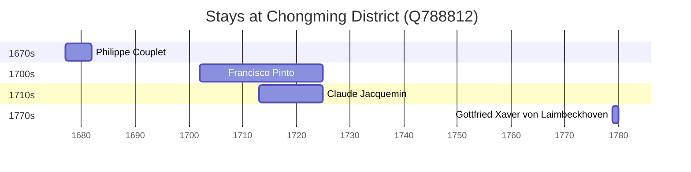

# Chongming District (Q788812)

*District*

Wikidata: [Q788812](https://www.wikidata.org/wiki/Q788812)

5 occurrence(s) across 3 transcribed value(s), 4 person(s).

**Transcribed variants:**

- `Ilha de Tsungming (Tch'ong-ming)` (2×, 1677–1778)
- `Ilha de Tsung-ming` (1×, 1702–1702)
- `Ilha de Tsongming (Tch'ong-ming)` (2×, 1713–1719)

| Date | Variant | Person | Type | Entity id | Real entity |
|------|---------|--------|------|-----------|-------------|
| 1677 | Ilha de Tsungming (Tch'ong-ming) | Philippe Couplet | estadia | [deh-philippe-couplet](deh-philippe-couplet) | [rp551005](rp551005) |
| 1702 | Ilha de Tsung-ming | Francisco Pinto | estadia | [deh-francisco-pinto-i](deh-francisco-pinto-i) | — |
| 1713 | Ilha de Tsongming (Tch'ong-ming) | Claude Jacquemin | estadia | [deh-claude-jacquemin](deh-claude-jacquemin) | — |
| 1719 | Ilha de Tsongming (Tch'ong-ming) | Claude Jacquemin | estadia | [deh-claude-jacquemin](deh-claude-jacquemin) | — |
| 1778-11-13 | Ilha de Tsungming (Tch'ong-ming) | Gottfried Xaver von Laimbeckhoven | estadia | [deh-gottfried-xaver-von-laimbeckhoven](deh-gottfried-xaver-von-laimbeckhoven) | — |

### Co-presence

These persons were plausibly at this place during overlapping periods (interval estimation from stay dates; rough — see method note below).

| Period | Persons |
|--------|---------|
| 1710s | [Claude Jacquemin](deh-claude-jacquemin), [Francisco Pinto](deh-francisco-pinto-i) |

*1 overlapping pair(s) involving 2 person(s). Method: interval start = stay event date; end = next embarque/partida/different-place event, or death, or +15yr cap.*

