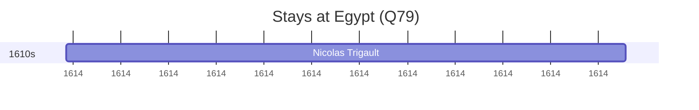

# Egypt (Q79)

*country in Northeast Africa and Southwest Asia*

Wikidata: [Q79](https://www.wikidata.org/wiki/Q79)

1 occurrence(s) across 1 transcribed value(s), 1 person(s).

**Transcribed variants:**

- `Egipto` (1×, undated)

| Date | Variant | Person | Type | Entity id | Real entity |
|------|---------|--------|------|-----------|-------------|
| <1614-10-11 | Egipto | Nicolas Trigault | estadia | [deh-nicolas-trigault](deh-nicolas-trigault) | — |

