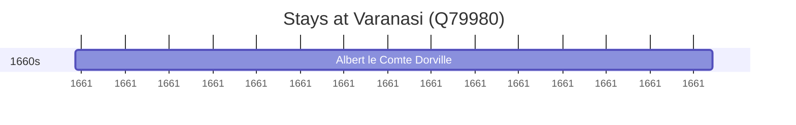

# Varanasi (Q79980)

*city on the banks of the Ganges in the Uttar Pradesh state of India*

Wikidata: [Q79980](https://www.wikidata.org/wiki/Q79980)

1 occurrence(s) across 1 transcribed value(s), 1 person(s).

**Transcribed variants:**

- `Benares` (1×, undated)

| Date | Variant | Person | Type | Entity id | Real entity |
|------|---------|--------|------|-----------|-------------|
| >1661 | Benares | Albert le Comte Dorville | estadia | [deh-albert-le-comte-dorville](deh-albert-le-comte-dorville) | — |

