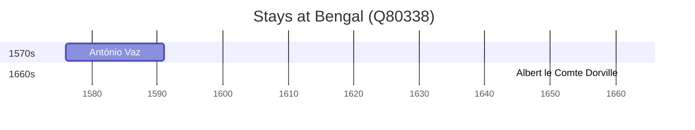

# Bengal (Q80338)

*historical and geographical region in the east region of the Indian subcontinent*

Wikidata: [Q80338](https://www.wikidata.org/wiki/Q80338)

3 occurrence(s) across 1 transcribed value(s), 3 person(s).

**Transcribed variants:**

- `Bengala` (3×, 1576–1694)

| Date | Variant | Person | Type | Entity id | Real entity |
|------|---------|--------|------|-----------|-------------|
| 1576 | Bengala | António Vaz | estadia | [deh-antonio-vaz-ref1](deh-antonio-vaz-ref1) | — |
| 1694-05-01 | Bengala | Louis Archambaud | morte | [deh-louis-archambaud](deh-louis-archambaud) | — |
| >1661 | Bengala | Albert le Comte Dorville | estadia | [deh-albert-le-comte-dorville](deh-albert-le-comte-dorville) | — |

