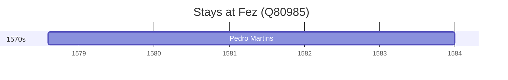

# Fez (Q80985)

*city in Morocco*

Wikidata: [Q80985](https://www.wikidata.org/wiki/Q80985)

2 occurrence(s) across 1 transcribed value(s), 1 person(s).

**Transcribed variants:**

- `Fez` (2×, 1578–1584)

| Date | Variant | Person | Type | Entity id | Real entity |
|------|---------|--------|------|-----------|-------------|
| 1578-08-04 | Fez | Pedro Martins | estadia | [deh-pedro-martins](deh-pedro-martins) | — |
| 1584 | Fez | Pedro Martins | estadia | [deh-pedro-martins](deh-pedro-martins) | — |

