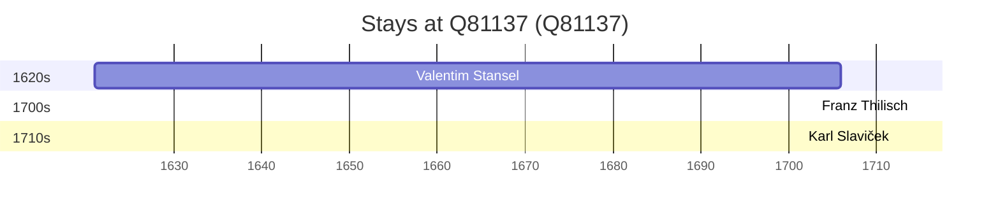

# Q81137

*(fetch error: HTTP Error 429: Too Many Requests)*

Wikidata: [Q81137](https://www.wikidata.org/wiki/Q81137)

4 occurrence(s) across 1 transcribed value(s), 3 person(s).

**Transcribed variants:**

- `Olomouc` (4×, 1621–1712)

| Date | Variant | Person | Type | Entity id | Real entity |
|------|---------|--------|------|-----------|-------------|
| 1621 | Olomouc | Valentim Stansel | nascimento | [deh-valentim-stansel](deh-valentim-stansel) | — |
| 1654-11-01 | Olomouc | Valentim Stansel | jesuita-votos-local | [deh-valentim-stansel](deh-valentim-stansel) | — |
| 1703-02-02 | Olomouc | Franz Thilisch | jesuita-votos-local | [deh-franz-thilisch](deh-franz-thilisch) | — |
| 1712-02-02 | Olomouc | Karl Slaviček | jesuita-votos-local | [deh-karl-slavicek](deh-karl-slavicek) | — |

### Co-presence

These persons were plausibly at this place during overlapping periods (interval estimation from stay dates; rough — see method note below).

| Period | Persons |
|--------|---------|
| 1700s | [Franz Thilisch](deh-franz-thilisch), [Valentim Stansel](deh-valentim-stansel) |

*1 overlapping pair(s) involving 2 person(s). Method: interval start = stay event date; end = next embarque/partida/different-place event, or death, or +15yr cap.*

