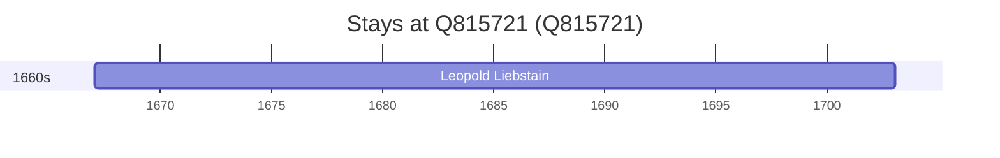

# Q815721

*(fetch error: HTTP Error 429: Too Many Requests)*

Wikidata: [Q815721](https://www.wikidata.org/wiki/Q815721)

1 occurrence(s) across 1 transcribed value(s), 1 person(s).

**Transcribed variants:**

- `Neisse, Silésia` (1×, 1667–1667)

| Date | Variant | Person | Type | Entity id | Real entity |
|------|---------|--------|------|-----------|-------------|
| 1667-01-20 | Neisse, Silésia | Leopold Liebstain | nascimento | [deh-leopold-liebstain](deh-leopold-liebstain) | — |

