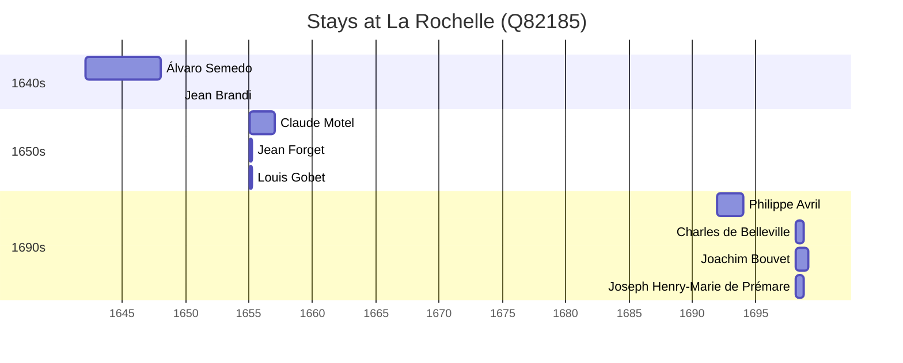

# La Rochelle (Q82185)

*French commune and prefecture of Charente-Maritime, New Aquitaine*

Wikidata: [Q82185](https://www.wikidata.org/wiki/Q82185)

9 occurrence(s) across 1 transcribed value(s), 9 person(s).

**Transcribed variants:**

- `La Rochelle` (9×, 1642–1698)

| Date | Variant | Person | Type | Entity id | Real entity |
|------|---------|--------|------|-----------|-------------|
| 1642-02 | La Rochelle | Álvaro Semedo | chegada | [deh-alvaro-semedo](deh-alvaro-semedo) | — |
| 1649-06-20 | La Rochelle | Jean Brandi | jesuita-votos-local | [deh-jean-brandi](deh-jean-brandi) | — |
| 1655-02 | La Rochelle | Claude Motel | estadia | [deh-claude-motel](deh-claude-motel) | — |
| 1655-02 | La Rochelle | Jean Forget | estadia | [deh-jean-forget](deh-jean-forget) | — |
| 1655-02 | La Rochelle | Louis Gobet | estadia | [deh-louis-gobet](deh-louis-gobet) | — |
| 1692 | La Rochelle | Philippe Avril | estadia | [deh-philippe-avril](deh-philippe-avril) | [rp636254](rp636254) |
| 1698-03-06 | La Rochelle | Charles de Belleville | estadia | [deh-charles-de-belleville](deh-charles-de-belleville) | [rp033271](rp033271) |
| 1698-03-07 | La Rochelle | Joachim Bouvet | estadia | [deh-joachim-bouvet](deh-joachim-bouvet) | [rp407623](rp407623) |
| 1698-03-07 | La Rochelle | Joseph Henry-Marie de Prémare | estadia | [deh-joseph-henry-marie-de-premare](deh-joseph-henry-marie-de-premare) | — |

### Co-presence

These persons were plausibly at this place during overlapping periods (interval estimation from stay dates; rough — see method note below).

| Period | Persons |
|--------|---------|
| 1650s | [Claude Motel](deh-claude-motel), [Jean Forget](deh-jean-forget), [Louis Gobet](deh-louis-gobet) |
| 1690s | [Charles de Belleville](rp033271), [Joachim Bouvet](rp407623), [Joseph Henry-Marie de Prémare](deh-joseph-henry-marie-de-premare) |

*6 overlapping pair(s) involving 6 person(s). Method: interval start = stay event date; end = next embarque/partida/different-place event, or death, or +15yr cap.*

