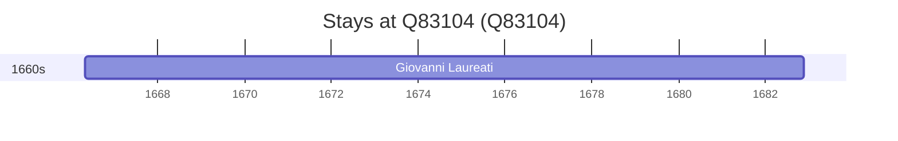

# Q83104

*(fetch error: HTTP Error 429: Too Many Requests)*

Wikidata: [Q83104](https://www.wikidata.org/wiki/Q83104)

2 occurrence(s) across 2 transcribed value(s), 1 person(s).

**Transcribed variants:**

- `Montecosaro` (1×, 1666–1666)
- `Montecosaro (paróquia de S. Lorenzo Martire)` (1×, 1666–1666)

| Date | Variant | Person | Type | Entity id | Real entity |
|------|---------|--------|------|-----------|-------------|
| 1666-04-27 | Montecosaro | Giovanni Laureati | nascimento | [deh-giovanni-laureati](deh-giovanni-laureati) | [rp323905](rp323905) |
| 1666-04-28 | Montecosaro (paróquia de S. Lorenzo Martire) | Giovanni Laureati | baptizado | [deh-giovanni-laureati](deh-giovanni-laureati) | [rp323905](rp323905) |

