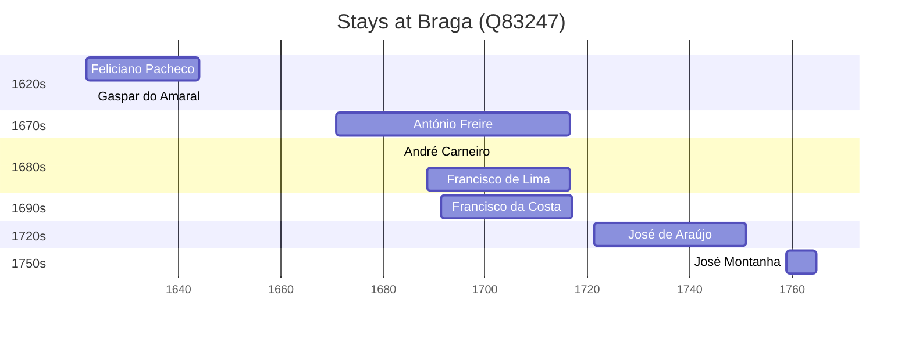

# Braga (Q83247)

*municipality in Portugal*

Wikidata: [Q83247](https://www.wikidata.org/wiki/Q83247)

8 occurrence(s) across 2 transcribed value(s), 8 person(s).

**Transcribed variants:**

- `Braga` (7×, 1622–1721)
- `Braga (colégio)` (1×, 1759–1759)

| Date | Variant | Person | Type | Entity id | Real entity |
|------|---------|--------|------|-----------|-------------|
| 1622 | Braga | Feliciano Pacheco | nascimento | [deh-feliciano-pacheco](deh-feliciano-pacheco) | — |
| 1670-11-01 | Braga | António Freire | nascimento | [deh-antonio-freire](deh-antonio-freire) | — |
| 1682-12-08 | Braga | André Carneiro | jesuita-votos-local | [deh-andre-carneiro](deh-andre-carneiro) | — |
| 1688-10-04 | Braga | Francisco de Lima | nascimento | [deh-francisco-de-lima](deh-francisco-de-lima) | — |
| 1691-04-22 | Braga | Francisco da Costa | nascimento | [deh-francisco-da-costa](deh-francisco-da-costa) | — |
| 1721-05-10 | Braga | José de Araújo | nascimento | [deh-jose-de-araujo](deh-jose-de-araujo) | — |
| 1759 | Braga (colégio) | José Montanha | estadia | [deh-jose-montanha-ii](deh-jose-montanha-ii) | — |
| <1623-03-24 | Braga | Gaspar do Amaral | estadia-x | [deh-gaspar-do-amaral](deh-gaspar-do-amaral) | — |

### Co-presence

These persons were plausibly at this place during overlapping periods (interval estimation from stay dates; rough — see method note below).

| Period | Persons |
|--------|---------|
| 1620s | [Feliciano Pacheco](deh-feliciano-pacheco), [Gaspar do Amaral](deh-gaspar-do-amaral) |
| 1680s | [André Carneiro](deh-andre-carneiro), [António Freire](deh-antonio-freire), [Francisco de Lima](deh-francisco-de-lima) |
| 1690s | [António Freire](deh-antonio-freire), [Francisco da Costa](deh-francisco-da-costa), [Francisco de Lima](deh-francisco-de-lima) |

*5 overlapping pair(s) involving 6 person(s). Method: interval start = stay event date; end = next embarque/partida/different-place event, or death, or +15yr cap.*

