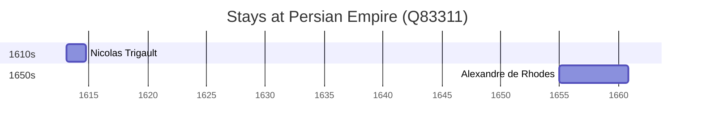

# Persian Empire (Q83311)

*series of historical empires existing until year 1979 approximately at the place of the state Iran*

Wikidata: [Q83311](https://www.wikidata.org/wiki/Q83311)

5 occurrence(s) across 1 transcribed value(s), 5 person(s).

**Transcribed variants:**

- `Pérsia` (5×, 1655–1655)

| Date | Variant | Person | Type | Entity id | Real entity |
|------|---------|--------|------|-----------|-------------|
| — | Pérsia | Gerard Arnould Rijckewaert | estadia | [deh-gerard-arnould-rijckewaert](deh-gerard-arnould-rijckewaert) | — |
| — | Pérsia | Louis Bazin | estadia | [deh-louis-bazin](deh-louis-bazin) | — |
| — | Pérsia | Michael-Pierre Boym | estadia | [deh-michael-pierre-boym](deh-michael-pierre-boym) | — |
| 1655 | Pérsia | Alexandre de Rhodes | estadia | [deh-alexandre-de-rhodes](deh-alexandre-de-rhodes) | — |
| >1613-02-09 | Pérsia | Nicolas Trigault | estadia | [deh-nicolas-trigault](deh-nicolas-trigault) | — |

