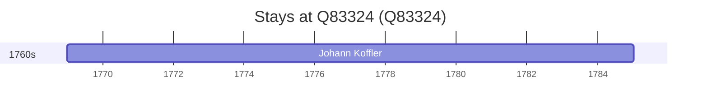

# Q83324

*(fetch error: HTTP Error 429: Too Many Requests)*

Wikidata: [Q83324](https://www.wikidata.org/wiki/Q83324)

2 occurrence(s) across 1 transcribed value(s), 1 person(s).

**Transcribed variants:**

- `Sibiu, Transilvânia` (2×, 1769–1785)

| Date | Variant | Person | Type | Entity id | Real entity |
|------|---------|--------|------|-----------|-------------|
| 1769 | Sibiu, Transilvânia | Johann Koffler | estadia | [deh-johann-koffler](deh-johann-koffler) | — |
| 1785-01-08 | Sibiu, Transilvânia | Johann Koffler | morte | [deh-johann-koffler](deh-johann-koffler) | — |

