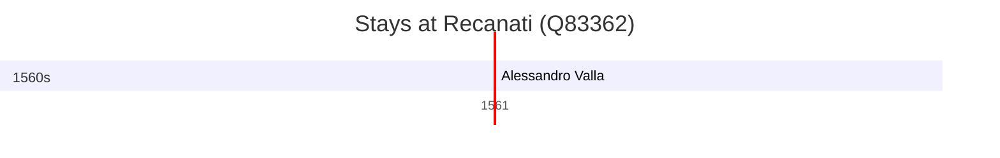

# Recanati (Q83362)

*Italian comune*

Wikidata: [Q83362](https://www.wikidata.org/wiki/Q83362)

1 occurrence(s) across 1 transcribed value(s), 1 person(s).

**Transcribed variants:**

- `Recanati` (1×, 1561–1561)

| Date | Variant | Person | Type | Entity id | Real entity |
|------|---------|--------|------|-----------|-------------|
| 1561-04-05 | Recanati | Alessandro Valla | jesuita-ordenacao-padre | [deh-alessandro-valla](deh-alessandro-valla) | — |

