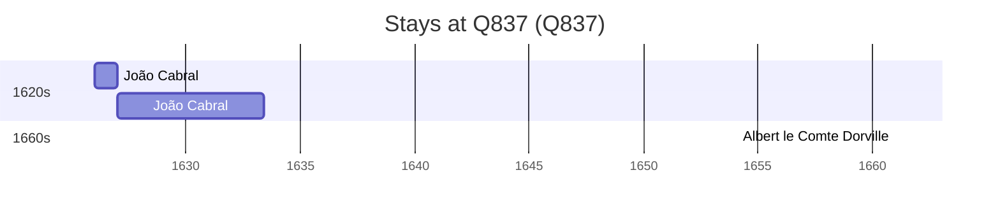

# Q837

*(fetch error: HTTP Error 429: Too Many Requests)*

Wikidata: [Q837](https://www.wikidata.org/wiki/Q837)

4 occurrence(s) across 1 transcribed value(s), 3 person(s).

**Transcribed variants:**

- `Nepal` (4×, 1626–1627)

| Date | Variant | Person | Type | Entity id | Real entity |
|------|---------|--------|------|-----------|-------------|
| — | Nepal | Johann Grueber | estadia | [deh-johann-grueber](deh-johann-grueber) | — |
| 1626 | Nepal | João Cabral | estadia | [deh-joao-cabral](deh-joao-cabral) | — |
| 1627 | Nepal | João Cabral | estadia | [deh-joao-cabral](deh-joao-cabral) | — |
| >1661 | Nepal | Albert le Comte Dorville | estadia | [deh-albert-le-comte-dorville](deh-albert-le-comte-dorville) | — |

