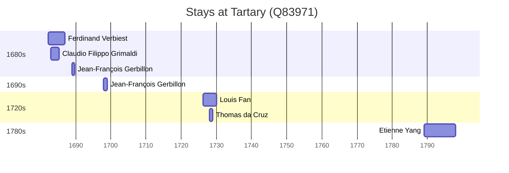

# Tartary (Q83971)

*European geographical term describing the region of Central and Northern Asia, sometimes together with steppe Europe, used from the Middle Ages to the beginning of the 19th century*

Wikidata: [Q83971](https://www.wikidata.org/wiki/Q83971)

12 occurrence(s) across 1 transcribed value(s), 9 person(s).

**Transcribed variants:**

- `Tartária` (12×, 1682–1789)

| Date | Variant | Person | Type | Entity id | Real entity |
|------|---------|--------|------|-----------|-------------|
| — | Tartária | Bernard Rodes | estadia | [deh-bernard-rodes](deh-bernard-rodes) | — |
| — | Tartária | Francisco Xavier Rosario Ho | estadia | [deh-francisco-xavier-rosario-ho](deh-francisco-xavier-rosario-ho) | [rp419976](rp419976) |
| 1682-03-23 | Tartária | Ferdinand Verbiest | estadia | [deh-ferdinand-verbiest](deh-ferdinand-verbiest) | [rp339905](rp339905) |
| 1683 | Tartária | Claudio Filippo Grimaldi | estadia | [deh-claudio-filippo-grimaldi](deh-claudio-filippo-grimaldi) | — |
| 1685 | Tartária | Claudio Filippo Grimaldi | estadia | [deh-claudio-filippo-grimaldi](deh-claudio-filippo-grimaldi) | — |
| 1689 | Tartária | Jean-François Gerbillon | estadia | [deh-jean-francois-gerbillon](deh-jean-francois-gerbillon) | — |
| 1698 | Tartária | Jean-François Gerbillon | estadia | [deh-jean-francois-gerbillon](deh-jean-francois-gerbillon) | — |
| 1715-11-10 | Tartária | Bernard Rodes | morte | [deh-bernard-rodes](deh-bernard-rodes) | — |
| 1720-11-30 | Tartária | Pierre Jartoux | morte | [deh-pierre-jartoux](deh-pierre-jartoux) | — |
| 1726-04 | Tartária | Louis Fan | estadia | [deh-louis-fan](deh-louis-fan) | — |
| 1728 | Tartária | Thomas da Cruz | estadia | [deh-thomas-da-cruz](deh-thomas-da-cruz) | — |
| 1789 | Tartária | Etienne Yang | estadia | [deh-etienne-yang](deh-etienne-yang) | — |

### Co-presence

These persons were plausibly at this place during overlapping periods (interval estimation from stay dates; rough — see method note below).

| Period | Persons |
|--------|---------|
| 1680s | [Claudio Filippo Grimaldi](deh-claudio-filippo-grimaldi), [Ferdinand Verbiest](rp339905) |
| 1720s | [Louis Fan](deh-louis-fan), [Thomas da Cruz](deh-thomas-da-cruz) |

*2 overlapping pair(s) involving 4 person(s). Method: interval start = stay event date; end = next embarque/partida/different-place event, or death, or +15yr cap.*

