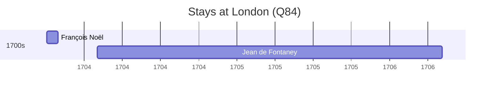

# London (Q84)

*capital and largest city of England and the United Kingdom*

Wikidata: [Q84](https://www.wikidata.org/wiki/Q84)

2 occurrence(s) across 1 transcribed value(s), 2 person(s).

**Transcribed variants:**

- `Londres` (2×, 1703–1704)

| Date | Variant | Person | Type | Entity id | Real entity |
|------|---------|--------|------|-----------|-------------|
| 1703-10-04 | Londres | François Noël | chegada | [deh-francois-noel](deh-francois-noel) | — |
| 1704-02 | Londres | Jean de Fontaney | estadia | [deh-jean-de-fontaney](deh-jean-de-fontaney) | — |

