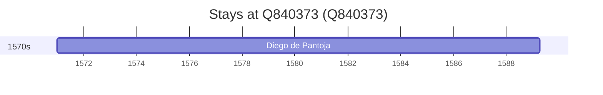

# Q840373

*(fetch error: HTTP Error 429: Too Many Requests)*

Wikidata: [Q840373](https://www.wikidata.org/wiki/Q840373)

1 occurrence(s) across 1 transcribed value(s), 1 person(s).

**Transcribed variants:**

- `Valdemoro, diocese de Toledo` (1×, 1571–1571)

| Date | Variant | Person | Type | Entity id | Real entity |
|------|---------|--------|------|-----------|-------------|
| 1571 | Valdemoro, diocese de Toledo | Diego de Pantoja | nascimento | [deh-diego-de-pantoja](deh-diego-de-pantoja) | — |

