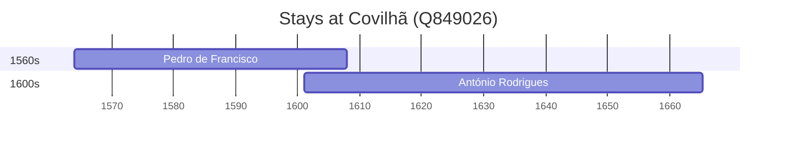

# Covilhã (Q849026)

*municipality in Portugal*

Wikidata: [Q849026](https://www.wikidata.org/wiki/Q849026)

2 occurrence(s) across 1 transcribed value(s), 2 person(s).

**Transcribed variants:**

- `Covilhã, diocese da Guarda` (2×, 1564–1601)

| Date | Variant | Person | Type | Entity id | Real entity |
|------|---------|--------|------|-----------|-------------|
| 1564 | Covilhã, diocese da Guarda | Pedro de Francisco | nascimento | [deh-pedro-de-francisco](deh-pedro-de-francisco) | — |
| 1601 | Covilhã, diocese da Guarda | António Rodrigues | nascimento | [deh-antonio-rodrigues-ii](deh-antonio-rodrigues-ii) | — |

### Co-presence

These persons were plausibly at this place during overlapping periods (interval estimation from stay dates; rough — see method note below).

| Period | Persons |
|--------|---------|
| 1600s | [António Rodrigues](deh-antonio-rodrigues-ii), [Pedro de Francisco](deh-pedro-de-francisco) |

*1 overlapping pair(s) involving 2 person(s). Method: interval start = stay event date; end = next embarque/partida/different-place event, or death, or +15yr cap.*

