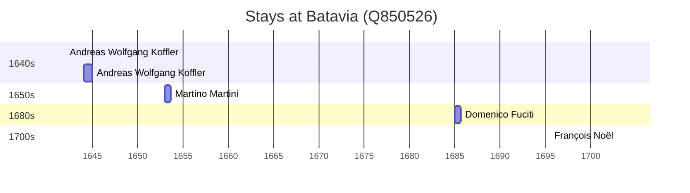

# Batavia (Q850526)

*historical and geographical region in the Netherlands*

Wikidata: [Q850526](https://www.wikidata.org/wiki/Q850526)

5 occurrence(s) across 1 transcribed value(s), 4 person(s).

**Transcribed variants:**

- `Batávia` (5×, 1642–1703)

| Date | Variant | Person | Type | Entity id | Real entity |
|------|---------|--------|------|-----------|-------------|
| 1642 | Batávia | Andreas Wolfgang Koffler | estadia | [deh-andreas-wolfgang-koffler](deh-andreas-wolfgang-koffler) | — |
| 1644 | Batávia | Andreas Wolfgang Koffler | estadia | [deh-andreas-wolfgang-koffler](deh-andreas-wolfgang-koffler) | — |
| 1653 | Batávia | Martino Martini | estadia | [deh-martino-martini](deh-martino-martini) | — |
| 1684-12-23 | Batávia | Domenico Fuciti | chegada | [deh-domenico-fuciti](deh-domenico-fuciti) | — |
| 1703 | Batávia | François Noël | estadia | [deh-francois-noel](deh-francois-noel) | — |

