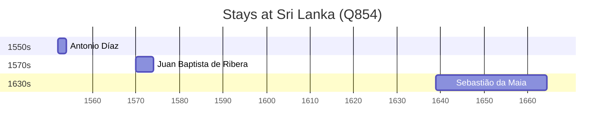

# Sri Lanka (Q854)

*island country in South Asia*

Wikidata: [Q854](https://www.wikidata.org/wiki/Q854)

4 occurrence(s) across 1 transcribed value(s), 4 person(s).

**Transcribed variants:**

- `Ceilão` (4×, 1552–1639)

| Date | Variant | Person | Type | Entity id | Real entity |
|------|---------|--------|------|-----------|-------------|
| — | Ceilão | João Cabral | estadia | [deh-joao-cabral](deh-joao-cabral) | — |
| 1552 | Ceilão | Antonio Díaz | estadia | [deh-antonio-diaz](deh-antonio-diaz) | — |
| 1570 | Ceilão | Juan Baptista de Ribera | estadia | [deh-juan-baptista-de-ribera](deh-juan-baptista-de-ribera) | — |
| 1639 | Ceilão | Sebastião da Maia | estadia | [deh-sebastiao-da-maia](deh-sebastiao-da-maia) | — |

