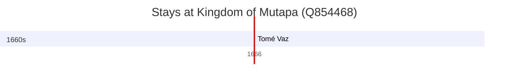

# Kingdom of Mutapa (Q854468)

*kingdom in southern Africa between 1430 and 1760*

Wikidata: [Q854468](https://www.wikidata.org/wiki/Q854468)

1 occurrence(s) across 1 transcribed value(s), 1 person(s).

**Transcribed variants:**

- `Reino de Monomotapa` (1×, 1666–1666)

| Date | Variant | Person | Type | Entity id | Real entity |
|------|---------|--------|------|-----------|-------------|
| 1666-08-15 | Reino de Monomotapa | Tomé Vaz | jesuita-votos-local | [deh-tome-vaz](deh-tome-vaz) | — |

