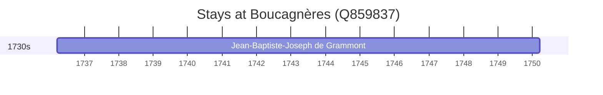

# Boucagnères (Q859837)

*commune in Gers, France*

Wikidata: [Q859837](https://www.wikidata.org/wiki/Q859837)

1 occurrence(s) across 1 transcribed value(s), 1 person(s).

**Transcribed variants:**

- `Boucagnères (palácio do marquês de Grammont), Gasconha` (1×, 1736–1736)

| Date | Variant | Person | Type | Entity id | Real entity |
|------|---------|--------|------|-----------|-------------|
| 1736-03-19 | Boucagnères (palácio do marquês de Grammont), Gasconha | Jean-Baptiste-Joseph de Grammont | nascimento | [deh-jean-baptiste-joseph-de-grammont](deh-jean-baptiste-joseph-de-grammont) | — |

