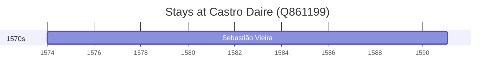

# Castro Daire (Q861199)

*municipality of Portugal*

Wikidata: [Q861199](https://www.wikidata.org/wiki/Q861199)

1 occurrence(s) across 1 transcribed value(s), 1 person(s).

**Transcribed variants:**

- `Castro Daire, diocese de Lamego` (1×, 1574–1574)

| Date | Variant | Person | Type | Entity id | Real entity |
|------|---------|--------|------|-----------|-------------|
| 1574 | Castro Daire, diocese de Lamego | Sebastião Vieira | nascimento | [deh-sebastiao-vieira](deh-sebastiao-vieira) | — |

