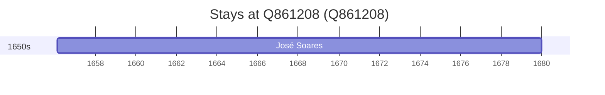

# Q861208

*(fetch error: HTTP Error 429: Too Many Requests)*

Wikidata: [Q861208](https://www.wikidata.org/wiki/Q861208)

1 occurrence(s) across 1 transcribed value(s), 1 person(s).

**Transcribed variants:**

- `Santa Comba Dão, diocese de Coimbra` (1×, 1656–1656)

| Date | Variant | Person | Type | Entity id | Real entity |
|------|---------|--------|------|-----------|-------------|
| 1656-02-15 | Santa Comba Dão, diocese de Coimbra | José Soares | nascimento | [deh-jose-soares](deh-jose-soares) | — |

