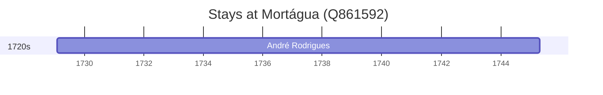

# Mortágua (Q861592)

*municipality of Portugal*

Wikidata: [Q861592](https://www.wikidata.org/wiki/Q861592)

1 occurrence(s) across 1 transcribed value(s), 1 person(s).

**Transcribed variants:**

- `Mortágua, diocese de Coimbra` (1×, 1729–1729)

| Date | Variant | Person | Type | Entity id | Real entity |
|------|---------|--------|------|-----------|-------------|
| 1729-02-02 | Mortágua, diocese de Coimbra | André Rodrigues | nascimento | [deh-andre-rodrigues](deh-andre-rodrigues) | — |

