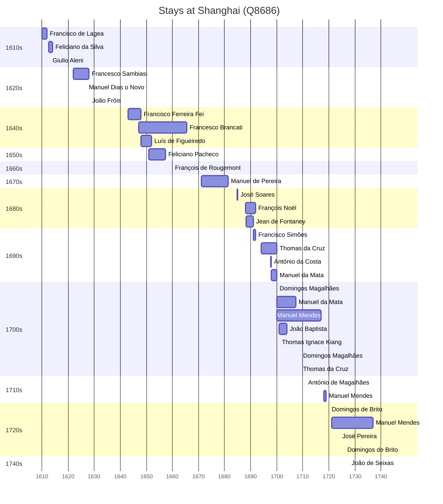

# Shanghai (Q8686)

*provincial-level municipality in China*

Wikidata: [Q8686](https://www.wikidata.org/wiki/Q8686)

40 occurrence(s) across 5 transcribed value(s), 29 person(s).

**Transcribed variants:**

- `Shanghai` (33×, 1610–1745)
- `Shanghai, Kiangnan` (2×, 1651–1694)
- `Shanghai (Igreja da Companhia)` (1×, 1679–1679)
- `Shanghai, Kiang-nan` (1×, 1691–1691)
- `Kiangnan, Shanghai` (3×, 1700–1713)

| Date | Variant | Person | Type | Entity id | Real entity |
|------|---------|--------|------|-----------|-------------|
| — | Kiangnan, Shanghai | Manuel Jorge | estadia | [deh-manuel-jorge](deh-manuel-jorge) | — |
| — | Shanghai | Martino Martini | estadia | [deh-martino-martini](deh-martino-martini) | — |
| 1610 | Shanghai | Francisco de Lagea | jesuita-entrada | [deh-francisco-de-lagea](deh-francisco-de-lagea) | — |
| 1612-09 | Shanghai | Feliciano da Silva | estadia | [deh-feliciano-da-silva](deh-feliciano-da-silva) | — |
| 1622 | Shanghai | Francesco Sambiasi | estadia | [deh-francesco-sambiasi](deh-francesco-sambiasi) | — |
| 1627 | Shanghai | Manuel Dias, o Novo | estadia | [deh-manuel-dias-o-novo](deh-manuel-dias-o-novo) | — |
| 1628-04-23 | Shanghai | João Fróis | jesuita-votos-local | [deh-joao-frois](deh-joao-frois) | — |
| 1643 | Shanghai | Francisco Ferreira Fei | estadia | [deh-francisco-ferreira-fei](deh-francisco-ferreira-fei) | — |
| 1647 | Shanghai | Francesco Brancati | estadia | [deh-francesco-brancati](deh-francesco-brancati) | — |
| 1648 | Shanghai | Luís de Figueiredo | estadia | [deh-luis-de-figueiredo](deh-luis-de-figueiredo) | — |
| 1649-05-01 | Shanghai | Francesco Brancati | jesuita-votos-local | [deh-francesco-brancati](deh-francesco-brancati) | — |
| 1651 | Shanghai, Kiangnan | Feliciano Pacheco | estadia | [deh-feliciano-pacheco](deh-feliciano-pacheco) | — |
| 1660 | Shanghai | François de Rougemont | estadia | [deh-francois-de-rougemont](deh-francois-de-rougemont) | — |
| 1671 | Shanghai | Manuel de Pereira | estadia | [deh-manuel-de-pereira-ii](deh-manuel-de-pereira-ii) | — |
| 1673 | Shanghai | Manuel de Pereira | estadia | [deh-manuel-de-pereira-ii](deh-manuel-de-pereira-ii) | — |
| 1679-02-02 | Shanghai (Igreja da Companhia) | Manuel de Pereira | jesuita-votos-local | [deh-manuel-de-pereira-ii](deh-manuel-de-pereira-ii) | — |
| 1681-05-18 | Shanghai | Manuel de Pereira | morte | [deh-manuel-de-pereira-ii](deh-manuel-de-pereira-ii) | — |
| 1684-10-02 | Shanghai | José Soares | estadia | [deh-jose-soares](deh-jose-soares) | — |
| 1688 | Shanghai | François Noël | estadia | [deh-francois-noel](deh-francois-noel) | — |
| 1688-05 | Shanghai | Jean de Fontaney | estadia | [deh-jean-de-fontaney](deh-jean-de-fontaney) | — |
| 1691 | Shanghai, Kiang-nan | Francisco Simões | estadia | [deh-francisco-simoes](deh-francisco-simoes) | — |
| 1694 | Shanghai, Kiangnan | Thomas da Cruz | estadia | [deh-thomas-da-cruz](deh-thomas-da-cruz) | — |
| 1697-10 | Shanghai | António da Costa | estadia | [deh-antonio-da-costa-iii](deh-antonio-da-costa-iii) | — |
| 1698 | Shanghai | Manuel da Mata | estadia | [deh-manuel-da-mata](deh-manuel-da-mata) | — |
| 1700 | Shanghai | Domingos Magalhães | estadia | [deh-domingos-magalhaes](deh-domingos-magalhaes) | — |
| 1700 | Shanghai | Manuel da Mata | estadia | [deh-manuel-da-mata](deh-manuel-da-mata) | — |
| 1700 | Kiangnan, Shanghai | Manuel Mendes | estadia | [deh-manuel-mendes](deh-manuel-mendes) | [rp352197](rp352197) |
| 1701 | Shanghai | João Baptista | estadia | [deh-joao-baptista](deh-joao-baptista) | — |
| 1701 | Shanghai | Thomas Ignace Kiang | estadia | [deh-thomas-ignace-kiang](deh-thomas-ignace-kiang) | — |
| 1709-02-02 | Shanghai | Domingos Magalhães | jesuita-votos-local | [deh-domingos-magalhaes](deh-domingos-magalhaes) | — |
| 1709-02-02 | Shanghai | Thomas da Cruz | jesuita-votos-local | [deh-thomas-da-cruz](deh-thomas-da-cruz) | — |
| 1711-02-02 | Shanghai | António de Magalhães | jesuita-votos-local | [deh-antonio-de-magalhaes](deh-antonio-de-magalhaes) | — |
| 1713 | Kiangnan, Shanghai | Manuel Mendes | estadia | [deh-manuel-mendes](deh-manuel-mendes) | [rp352197](rp352197) |
| 1718 | Shanghai | Manuel Mendes | estadia | [deh-manuel-mendes](deh-manuel-mendes) | [rp352197](rp352197) |
| 1720 | Shanghai | Domingos de Brito | estadia | [deh-domingos-de-brito](deh-domingos-de-brito) | — |
| 1721 | Shanghai | Manuel Mendes | estadia | [deh-manuel-mendes](deh-manuel-mendes) | [rp352197](rp352197) |
| 1724 | Shanghai | José Pereira | estadia | [deh-jose-pereira](deh-jose-pereira) | — |
| 1726 | Shanghai | Domingos de Brito | estadia | [deh-domingos-de-brito](deh-domingos-de-brito) | — |
| 1745-12-08 | Shanghai | João de Seixas | jesuita-votos-local | [deh-joao-de-seixas](deh-joao-de-seixas) | — |
| >1613:<1619 | Shanghai | Giulio Aleni | estadia | [deh-giulio-aleni](deh-giulio-aleni) | — |

### Co-presence

These persons were plausibly at this place during overlapping periods (interval estimation from stay dates; rough — see method note below).

| Period | Persons |
|--------|---------|
| 1610s | [Feliciano da Silva](deh-feliciano-da-silva), [Giulio Aleni](deh-giulio-aleni) |
| 1620s | [Francesco Sambiasi](deh-francesco-sambiasi), [Manuel Dias, o Novo](deh-manuel-dias-o-novo) |
| 1640s | [Francesco Brancati](deh-francesco-brancati), [Francisco Ferreira Fei](deh-francisco-ferreira-fei), [Luís de Figueiredo](deh-luis-de-figueiredo) |
| 1650s | [Feliciano Pacheco](deh-feliciano-pacheco), [Francesco Brancati](deh-francesco-brancati), [Luís de Figueiredo](deh-luis-de-figueiredo) |
| 1660s | [Francesco Brancati](deh-francesco-brancati), [François de Rougemont](deh-francois-de-rougemont) |
| 1680s | [François Noël](deh-francois-noel), [Jean de Fontaney](deh-jean-de-fontaney) |
| 1690s | [António da Costa](deh-antonio-da-costa-iii), [Francisco Simões](deh-francisco-simoes), [François Noël](deh-francois-noel), [Manuel da Mata](deh-manuel-da-mata), [Thomas da Cruz](deh-thomas-da-cruz) |
| 1700s | [Domingos Magalhães](deh-domingos-magalhaes), [João Baptista](deh-joao-baptista), [Manuel Mendes](rp352197), [Manuel da Mata](deh-manuel-da-mata), [Thomas Ignace Kiang](deh-thomas-ignace-kiang), [Thomas da Cruz](deh-thomas-da-cruz) |
| 1710s | [António de Magalhães](deh-antonio-de-magalhaes), [Manuel Mendes](rp352197) |
| 1720s | [Domingos de Brito](deh-domingos-de-brito), [José Pereira](deh-jose-pereira), [Manuel Mendes](rp352197) |

*21 overlapping pair(s) involving 22 person(s). Method: interval start = stay event date; end = next embarque/partida/different-place event, or death, or +15yr cap.*

