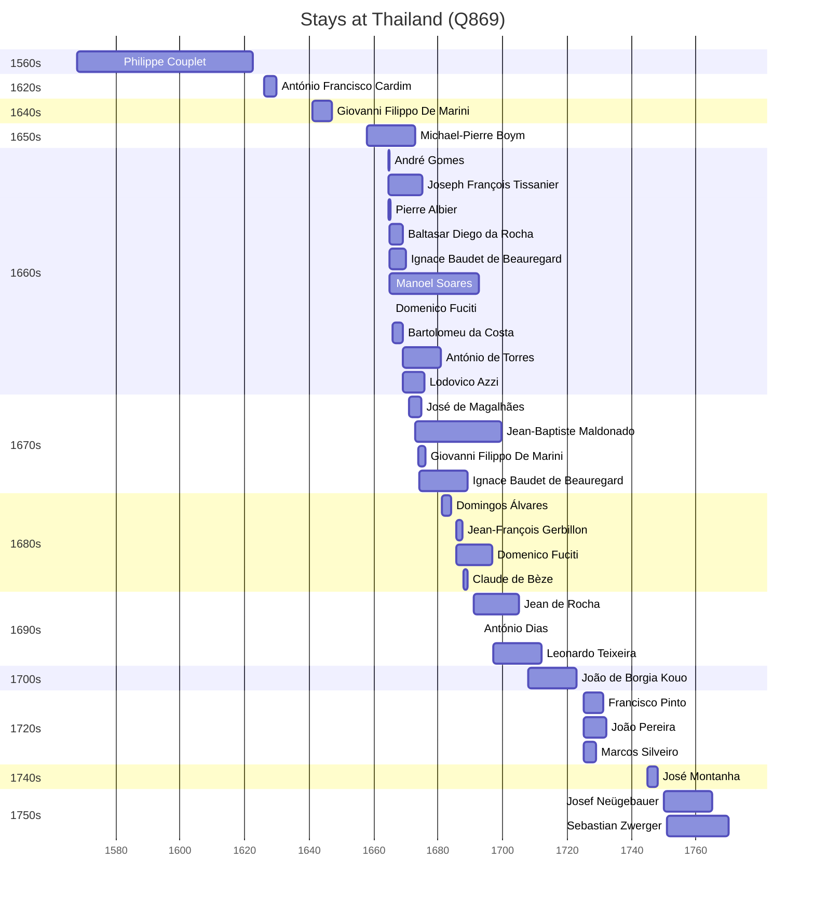

# Thailand (Q869)

*country in Southeast Asia*

Wikidata: [Q869](https://www.wikidata.org/wiki/Q869)

52 occurrence(s) across 3 transcribed value(s), 37 person(s).

**Transcribed variants:**

- `Sião` (50×, 1568–1751)
- `[No mar, perto do Sião]` (1×, 1568–1568)
- `Sião (Tailândia)` (1×, 1664–1664)

| Date | Variant | Person | Type | Entity id | Real entity |
|------|---------|--------|------|-----------|-------------|
| — | Sião | António de Melo | estadia | [deh-antonio-de-melo](deh-antonio-de-melo) | — |
| — | Sião | Carlo Giovanni Turcotti | estadia | [deh-carlo-giovanni-turcotti](deh-carlo-giovanni-turcotti) | — |
| — | Sião | Filippo-Maria Fieschi | estadia | [deh-filippo-maria-fieschi](deh-filippo-maria-fieschi) | — |
| — | Sião | Louis-Daniel Le Comte | estadia | [deh-louis-daniel-le-comte](deh-louis-daniel-le-comte) | — |
| — | Sião | Philipp Sibin | estadia | [deh-philipp-sibin](deh-philipp-sibin) | — |
| 1568 | Sião | Philippe Couplet | estadia | [deh-philippe-couplet](deh-philippe-couplet) | [rp551005](rp551005) |
| 1568 | [No mar, perto do Sião] | Hernando de Alcaraz | morte | [deh-hernando-de-alcaraz](deh-hernando-de-alcaraz) | — |
| 1626 | Sião | António Francisco Cardim | estadia | [deh-antonio-francisco-cardim](deh-antonio-francisco-cardim) | [rp536947](rp536947) |
| 1629 | Sião | António Francisco Cardim | estadia | [deh-antonio-francisco-cardim](deh-antonio-francisco-cardim) | [rp536947](rp536947) |
| 1641 | Sião | Giovanni Filippo De Marini | estadia | [deh-giovanni-filippo-de-marini](deh-giovanni-filippo-de-marini) | — |
| 1642 | Sião | Giovanni Filippo De Marini | estadia | [deh-giovanni-filippo-de-marini](deh-giovanni-filippo-de-marini) | — |
| 1654-11-25 | Sião | Ignatus Hartogvelt | morte | [deh-ignatus-hartogvelt](deh-ignatus-hartogvelt) | — |
| 1658 | Sião | Michael-Pierre Boym | estadia | [deh-michael-pierre-boym](deh-michael-pierre-boym) | — |
| 1664-07-29 | Sião | André Gomes | estadia | [deh-andre-gomes](deh-andre-gomes) | — |
| 1664-07-29 | Sião | Joseph François Tissanier | estadia | [deh-joseph-francois-tissanier](deh-joseph-francois-tissanier) | — |
| 1664-07-29 | Sião (Tailândia) | Pierre Albier | estadia | [deh-pierre-albier](deh-pierre-albier) | — |
| 1665 | Sião | André Gomes | estadia | [deh-andre-gomes](deh-andre-gomes) | — |
| 1665 | Sião | Baltasar Diego da Rocha | estadia | [deh-baltasar-diego-da-rocha](deh-baltasar-diego-da-rocha) | — |
| 1665 | Sião | Manoel Soares | chegada | [deh-manoel-soares](deh-manoel-soares) | — |
| 1665 | Sião | Ignace Baudet de Beauregard | estadia | [deh-ignace-baudet-de-beauregard](deh-ignace-baudet-de-beauregard) | — |
| 1665-02-20 | Sião | Pierre Albier | morte | [deh-pierre-albier](deh-pierre-albier) | — |
| 1665-04-13 | Sião | Domenico Fuciti | jesuita-votos-local | [deh-domenico-fuciti](deh-domenico-fuciti) | — |
| 1666 | Sião | Bartolomeu da Costa | estadia | [deh-bartolomeu-da-costa](deh-bartolomeu-da-costa) | — |
| 1669 | Sião | António de Torres | estadia | [deh-antonio-de-torres](deh-antonio-de-torres) | — |
| 1669 | Sião | Lodovico Azzi | estadia | [deh-lodovico-azzi](deh-lodovico-azzi) | — |
| 1671 | Sião | José de Magalhães | estadia | [deh-jose-de-magalhaes](deh-jose-de-magalhaes) | — |
| 1673 | Sião | Jean-Baptiste Maldonado | estadia | [deh-jean-baptiste-maldonado](deh-jean-baptiste-maldonado) | — |
| 1673 | Sião | José de Magalhães | estadia | [deh-jose-de-magalhaes](deh-jose-de-magalhaes) | — |
| 1673-11 | Sião | Giovanni Filippo De Marini | estadia | [deh-giovanni-filippo-de-marini](deh-giovanni-filippo-de-marini) | — |
| 1674 | Sião | Ignace Baudet de Beauregard | estadia | [deh-ignace-baudet-de-beauregard](deh-ignace-baudet-de-beauregard) | — |
| 1675-06-17 | Sião | António de Torres | estadia | [deh-antonio-de-torres](deh-antonio-de-torres) | — |
| 1681 | Sião | Domingos Álvares | estadia | [deh-domingos-alvares](deh-domingos-alvares) | — |
| 1684 | Sião | Jean-Baptiste Maldonado | estadia | [deh-jean-baptiste-maldonado](deh-jean-baptiste-maldonado) | — |
| 1685 | Sião | Manoel Soares | estadia | [deh-manoel-soares](deh-manoel-soares) | — |
| 1685-09 | Sião | Jean-François Gerbillon | chegada | [deh-jean-francois-gerbillon](deh-jean-francois-gerbillon) | — |
| 1685-09-23 | Sião | Domenico Fuciti | estadia | [deh-domenico-fuciti](deh-domenico-fuciti) | — |
| 1687 | Sião | Jean-Baptiste Maldonado | estadia | [deh-jean-baptiste-maldonado](deh-jean-baptiste-maldonado) | — |
| 1687-10 | Sião | Claude de Bèze | estadia | [deh-claude-de-beze](deh-claude-de-beze) | — |
| 1691 | Sião | Jean de Rocha | estadia | [deh-jean-de-rocha](deh-jean-de-rocha) | — |
| 1691 | Sião | Jean-Baptiste Maldonado | estadia | [deh-jean-baptiste-maldonado](deh-jean-baptiste-maldonado) | — |
| 1692-07 | Sião | Manoel Soares | morte | [deh-manoel-soares](deh-manoel-soares) | — |
| 1692-08-15 | Sião | António Dias | jesuita-votos-local | [deh-antonio-dias](deh-antonio-dias) | — |
| 1697 | Sião | Leonardo Teixeira | estadia | [deh-leonardo-teixeira](deh-leonardo-teixeira) | — |
| 1708 | Sião | João de Borgia Kouo | estadia | [deh-joao-de-borgia-kouo](deh-joao-de-borgia-kouo) | — |
| 1724 | Sião | José de Almeida | partida | [deh-jose-de-almeida-ii](deh-jose-de-almeida-ii) | — |
| 1725 | Sião | Marcos Silveiro | estadia | [deh-marcos-silveiro](deh-marcos-silveiro) | — |
| 1725 | Sião | Francisco Pinto | estadia | [deh-francisco-pinto-i](deh-francisco-pinto-i) | — |
| 1725 | Sião | João Pereira | estadia | [deh-joao-pereira-ii](deh-joao-pereira-ii) | — |
| 1745 | Sião | José Montanha | estadia | [deh-jose-montanha-ii](deh-jose-montanha-ii) | — |
| 1750 | Sião | Josef Neügebauer | estadia | [deh-josef-neugebauer](deh-josef-neugebauer) | — |
| 1751 | Sião | Josef Neügebauer | estadia | [deh-josef-neugebauer](deh-josef-neugebauer) | — |
| 1751 | Sião | Sebastian Zwerger | estadia | [deh-sebastian-zwerger](deh-sebastian-zwerger) | — |

### Co-presence

These persons were plausibly at this place during overlapping periods (interval estimation from stay dates; rough — see method note below).

| Period | Persons |
|--------|---------|
| 1660s | [André Gomes](deh-andre-gomes), [António de Torres](deh-antonio-de-torres), [Baltasar Diego da Rocha](deh-baltasar-diego-da-rocha), [Bartolomeu da Costa](deh-bartolomeu-da-costa), [Domenico Fuciti](deh-domenico-fuciti), [Ignace Baudet de Beauregard](deh-ignace-baudet-de-beauregard), [Joseph François Tissanier](deh-joseph-francois-tissanier), [Lodovico Azzi](deh-lodovico-azzi), [Manoel Soares](deh-manoel-soares), [Pierre Albier](deh-pierre-albier) |
| 1670s | [António de Torres](deh-antonio-de-torres), [Giovanni Filippo De Marini](deh-giovanni-filippo-de-marini), [Jean-Baptiste Maldonado](deh-jean-baptiste-maldonado), [Joseph François Tissanier](deh-joseph-francois-tissanier), [José de Magalhães](deh-jose-de-magalhaes), [Lodovico Azzi](deh-lodovico-azzi), [Manoel Soares](deh-manoel-soares) |
| 1680s | [Claude de Bèze](deh-claude-de-beze), [Domenico Fuciti](deh-domenico-fuciti), [Domingos Álvares](deh-domingos-alvares), [Jean-Baptiste Maldonado](deh-jean-baptiste-maldonado), [Jean-François Gerbillon](deh-jean-francois-gerbillon), [Manoel Soares](deh-manoel-soares) |
| 1690s | [António Dias](deh-antonio-dias), [Domenico Fuciti](deh-domenico-fuciti), [Jean de Rocha](deh-jean-de-rocha), [Jean-Baptiste Maldonado](deh-jean-baptiste-maldonado), [Manoel Soares](deh-manoel-soares) |
| 1720s | [Francisco Pinto](deh-francisco-pinto-i), [João Pereira](deh-joao-pereira-ii), [Marcos Silveiro](deh-marcos-silveiro) |

*61 overlapping pair(s) involving 21 person(s). Method: interval start = stay event date; end = next embarque/partida/different-place event, or death, or +15yr cap.*

