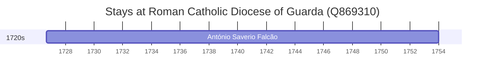

# Roman Catholic Diocese of Guarda (Q869310)

*diocese of the Catholic Church in Portugal*

Wikidata: [Q869310](https://www.wikidata.org/wiki/Q869310)

1 occurrence(s) across 1 transcribed value(s), 1 person(s).

**Transcribed variants:**

- `Diocese da Guarda` (1×, 1726–1726)

| Date | Variant | Person | Type | Entity id | Real entity |
|------|---------|--------|------|-----------|-------------|
| 1726-09-06 | Diocese da Guarda | António Saverio Falcão | nascimento | [deh-antonio-saverio-falcao](deh-antonio-saverio-falcao) | — |

